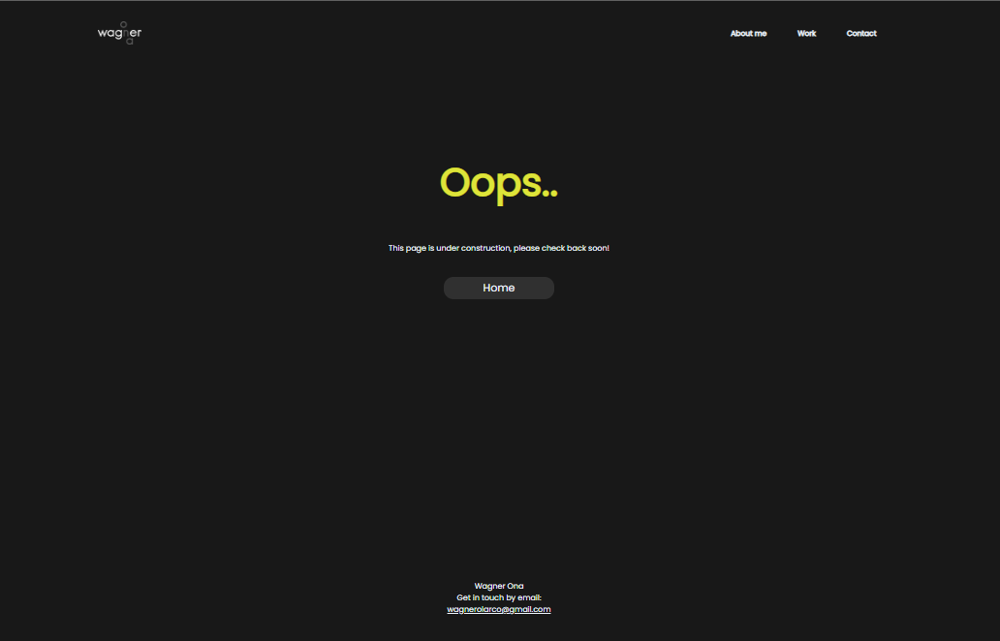

# Week 2 challenge to create portfolio

## Welcome to my responsive portfolio!

I am currently enrolled in a front-end web development bootcamp, and as part of the program, I am creating this portfolio to showcase my skills and projects.

The goal of this portfolio is to demonstrate my ability to create responsive, mobile-friendly layouts using HTML and CSS. I want to ensure that my portfolio looks great and is easy to use on a variety of devices, including smartphones, tablets, and desktop computers (media querys still to be added)

To achieve this goal, I will be using media queries and other techniques to create a flexible, grid-based layout that adjusts to the size and orientation of the viewport. I will also be using responsive images and other optimization techniques to ensure that my portfolio loads quickly and smoothly on all devices.

I hope you enjoy exploring my portfolio! If you have any feedback or suggestions, please don't hesitate to contact me.

## Acceptance criteria 

- When the page is loaded the page presents your name, a recent photo or avatar, and links to sections about you, your work, and how to contact you
- When one of the links in the navigation is clicked then the UI scrolls to the corresponding section
- When viewing the section about your work then the section contains titled images of your applications
- When presented with the your first application then that application's image should be larger in size than the others
- When images of the applications are clicked then the user is taken to that deployed application
- When the page is resized or viewed on various screens and devices then the layout is responsive and adapts to my viewport

## Usage

## 2 Bugs encountered so far
- As of time of submission the hyperlinks of the images are not working. Please click on the the "Main Projects" text to be redirected to the test page
- The media querys are not working properly, for some reason format is causing problems when testing for smaller screens

- *not much of a bug but css needs to be checked to make sure its optmized (consolidate items)*

Thes two issues will are as of 00:00 20/12/22, I will be speaking with a TA on the 21st to try and resolve this issues

*Please take this into consideration whilst checking out the deployed application*

Resources:

Slack Class Resources 

Github repo:

https://github.com/wagnerona/responsive-portfolio-wagnerLinks

Deployed Website/portfolio:

https://wagnerona.github.io/responsive-portfolio-wagner/

## Credits

N/A

## License

Check license in repo

